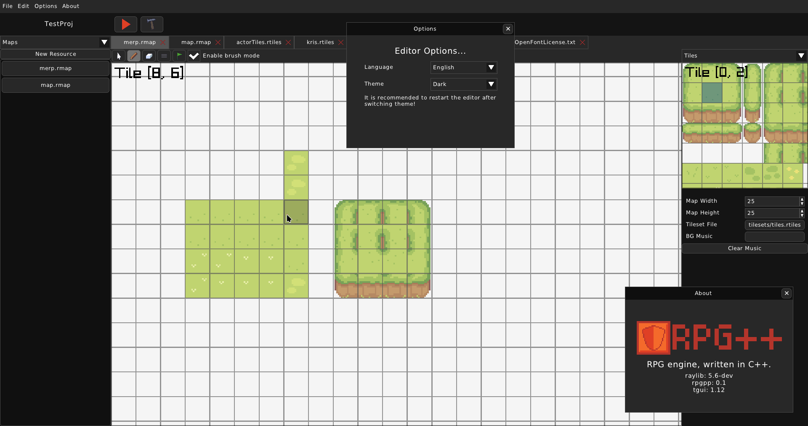

---

RPG++ is an experimental 2D RPG game engine written in C++. It is currently in early development, but contributions are welcome!

***This is a fresh restart, there are currently no RPG++ lua bindings, the engine hasn't been implemented in this branch yet.***



Requirements
---

To build RPG++, you'll need to install the following tools/packages:
- **For all platforms**:
  - [xmake](https://xmake.io/) (follow the instructions on the website to install XMake on your system)
  - [git](https://git-scm.com/)
- Specifically for _Linux_:
  - gcc, g++, make, and ninja (on Debian-based distros, you can install this via `sudo apt install build-essential`)
  - libx11-dev, libxrandr-dev, libxinerama-dev, libxcursor-dev, libxi-dev, libgl1-mesa-dev, and mesa-common-dev (Debian-based distros can install this via `sudo apt install libx11-dev libxrandr-dev libxinerama-dev libxcursor-dev libxi-dev libgl1-mesa-dev mesa-common-dev`)
- Specifically for _Windows_:
  - Visual Studio 2019 or later with Desktop development with C++ (community edition will suffice)

Building
---

Clone the project using git with

```bash
git clone https://github.com/CDevv/rpgpp
```

To build all targets, run

```bash
xmake build --all
```

If xmake failed to build, try force reinstalling the packages with
```bash
xmake clean --all # remove build artifacts
xmake require --clean # remove installed package cache for project
xmake require --force # force install of package
```

Running
---

To start the editor, run

```bash
xmake run editor
```

Translation
---

Translation are located in `resources/translations`, containing JSON files with their names being the language code.

Each JSON files is structured as either flattened JSON:
```json
{
	"language": "<name_of_language>",
	"translation.key": "<translation_value>"
}
```
or nested JSON:
```json
{
	"language": "<name_of_language>",
	"translation": {
		"key": "<translation_value>"
	}
}
```
Both types are supported, though we recommend using nested JSON for better organization.

If you wish to improve an existing language, you can do so by modifying the language file of the language you know. Or if you want to add a new language, create a new JSON file within the folder, specify the language via the `language` key, and then translate the root translation file (en_us.json). The engine will automatically pick it up.

To check for translation progress, you can do so via
```
xmake check_translation
```

License
---

This software is licensed under the MIT License.
