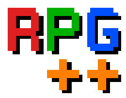

# rpgpp
RPG++ is an experimental 2D RPG game engine written in C++. It is currently in early development, but contributions are welcome!

## Building
This project uses [Xmake](https://xmake.io/) so you may need to download it for your system. 
You can build the project with:
```
sh deps.sh
xmake
```

If build was successful, you can find an `editor` executable at the root of this project.

## Running
### On Linux
```
./editor
```

### On Windows
```
editor.exe
```

## License
This software uses the MIT License.
