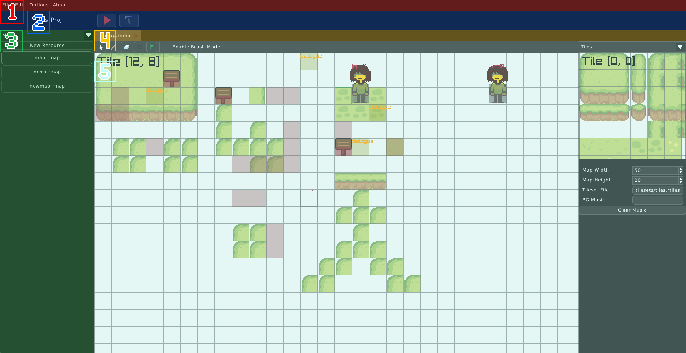
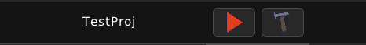
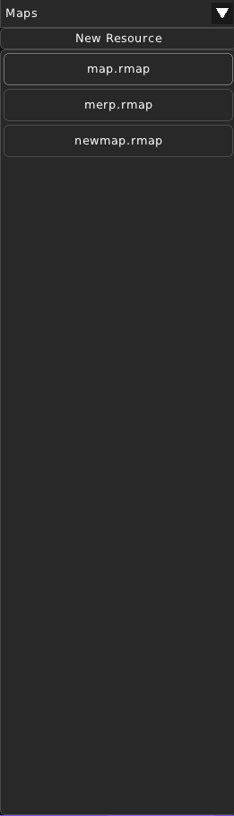

Editor Layout
=============

* `(1)` - **Menu Bar**

Here you have different options about the Editor or the currently opened project (if any)

    * File

        * *New Project* - Create a new project using the 'New Project' prompt.

        * *Open Project* - Open an already existing project using the file chooser dialog.

        * *Save File* - Save the currently opened file.

    * Edit

        * *Undo* - Undo the last action.

        * *Redo* - Redo the action that was last undone.

    * Options

        * *Editor Options..* - Open the 'Options' window.

    * About

        * *About RPG++* - Show 'About RPG++' window.

* `(2)` - **Project Menu**

Here you can see the title of the opened project, as well as a Playtest button and a Build button

    .. image:: ../images/rpgpp-projectplay.png
        :width: 40%

    * **Playtest** - Playtest the project

    .. image:: ../images/rpgpp-projectbuild.png
        :width: 40%

    * **Build** - Export the project. This will result in a .bin file and an executable file in the project's root directory.

* `(3)` - **Resources List**

Here you can see the resources of the project. The dropdown lets you choose which type of resource do you want to be listed. You can click on any file listed here. The "New Resource" button creates a new resource of the type that is currently chosen in the dropdown.

In this example, the Project's Maps are shown.

* `(4)` - **Opened Files Tabs**

Here you can see opened files here. You can close any of them. The currently opened file will be highlighted with a lighter background color. You can click on another tab to open it. 

* `(5)` - **File View**

In this View you can see information that you can edit about the currently opened file. 