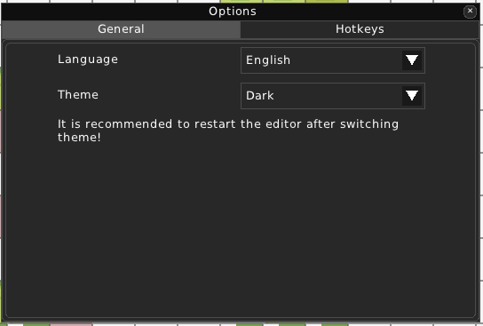
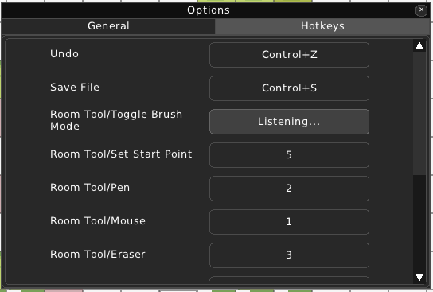

Editor Options
==============

After choosing 'Editor Options..' in the menu bar, an 'Options' window pops up.

=======
General
=======

* **Language**

Choose one of the available languages that RPG++ is translated in.

* **Theme**

Choose one of the available built-in themes for RPG++.

=======
Hotkeys
=======

In this category, you can set hotkeys to any bindable action. To do it, simply click on the button next to the action. The Editor will wait for you to click a button on your keyboard or a key combo.

