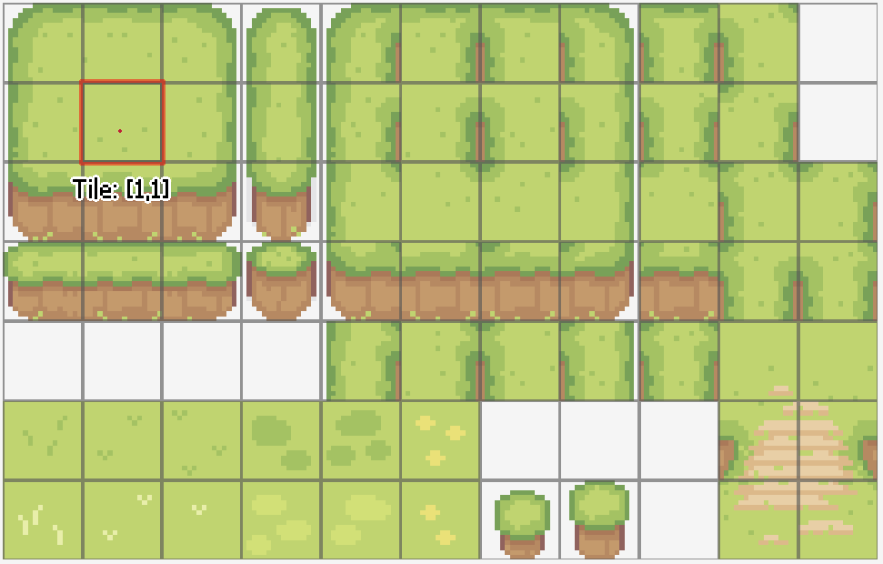
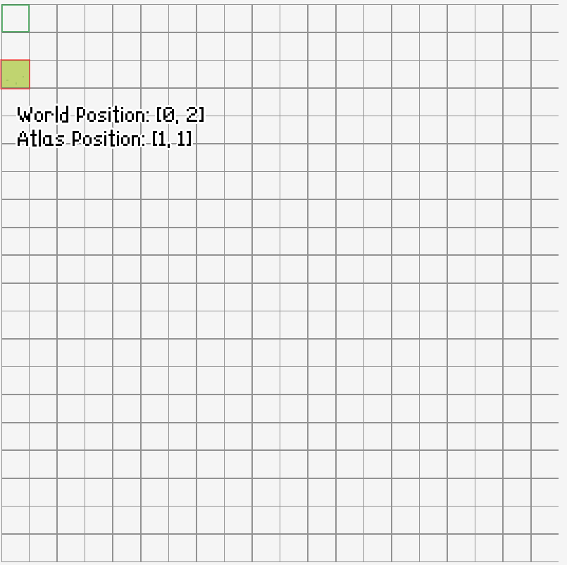

Main Concepts
=============

This page describes main terminologies that are in use in RPG++.

=================
Project Structure
=================

An RPG++ project consists of a `proj.rpgpp` file and directories for each resource type in the engine.
Each resource has an extension in its filename that is in use in RPG++ only. Resources themselves are JSON format files that follow a specific 'schema' that is specific to that resource type.

For example, a `TileSet` file would have the `.rtiles` extension and has only 'source', 'tileWidth' and 'tileHeight' fields in it.

Example of `TileSet` file contents:

.. code:: json

    {
        "source": "images/Hills.png",
        "tileWidth": 16,
        "tileHeight": 16
    }

=======================
Resource types in RPG++
=======================

Some resource types may have fields/properties that refer to a resource of another type.

For example, `TileSet` has a 'source' field that refers to an image resource called 'Hills.png'.

``"source": "images/Hills.png"``

Such fields have the name of the directory that contains the specific resource type. In this example, images are in the 'images' directory, which is a subdirectory of the project root directory.

Here is a list of all resource types:

* TileSet

==================
Rooms and TileSets
==================

When we use rooms or tilesets, we must understand the terms 'world position' and 'atlas position'

The 'atlas position' is the one that is used to identify a tile from a TileSet.

The 'world position' is the one that a tile from a Room can have. Tiles from Rooms can have both an 'atlas position' and a 'world position'.

