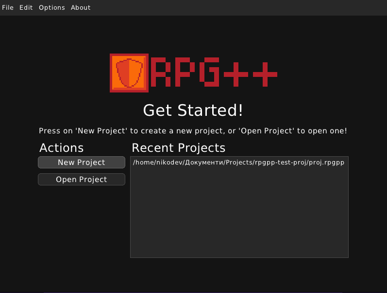
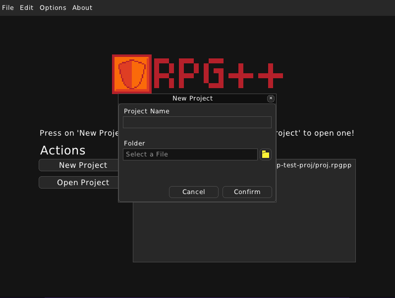

Make a New Project
==================

Upon starting RPG++, you are greeted with the welcome screen. Here you can see your recently opened projects and you have the options to create a new project or open an already existing project.

To make a new project, click on the 'New Project' button. It will present you with a dialog for creating a new project. Here you can type the new project's title and choose a location for it on your computer.

