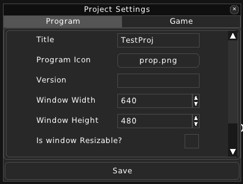

Project Settings
================

In this window you can change or view settings that will impact the game's window or the gameplay.

There are two categories in Project Settings:

* **Program**:

    This category changes how the program's window behaves.

    * **Title** - The Window's title.

    * **Version** - Version of the game.

    * **Program Icon** - The icon of the window.

    * **Window Width** - Width of the window.

    * **Window Height** - Height of the window.

    * **Is Window Resizeable** - Whether the window will be resizeable.

    * **Target FPS** - The frames per second that will be targeted.

* **Game**:

    This category changes the gameplay of the game.

    * **Default Room** - The room in which the player will first spawn.

    * **Player Actor** - The Actor file which will be used for the Player's appearance.

    * **Tile Size** - The tile size in maps.