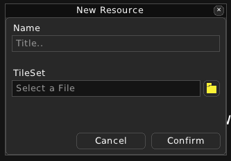
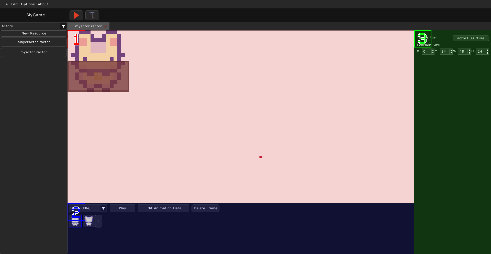
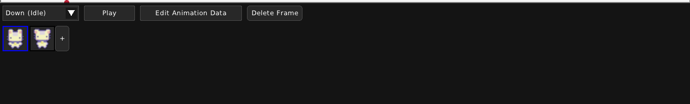

Actor
=====

=================
What is an Actor?
=================

An Actor represents a character in the world. The Player themselves have an Actor, that is used for their appearance. They can also interact with other Actors.

Actors use a `TileSet` for their appearance. Animations have frames and each frame has an atlas position. They're looped, also. That means that every second a frame from the Actor's current animation is shown and then the animation advances to the next frame.

Here is an example Actor file contents:

.. code:: json

    {
        "animations": {
            "down": [
                [2, 0],
                [3, 0]
            ],
            "down-idle": [
                [0, 0],
                [1, 0]
            ],
            "left": [
                [2, 2],
                [3, 2]
            ],
            "left-idle": [
                [0, 2],
                [1, 2]
            ],
            "right": [
                [2, 3],
                [3, 3]
            ],
            "right-idle": [
                [0, 3],
                [1, 3]
            ],
            "up": [
                [2, 1],
                [3, 1]
            ],
            "up-idle": [
                [0, 1],
                [1, 1]
            ]
        },
        "collision": [
            0,
            24,
            48,
            24
        ],
        "tileset": "tilesets/actorTiles.rtiles"
    }

=============================
Creating and editing an Actor
=============================

When creating an Actor, you must give a name and choose a TileSet for the Actor.

Then, the Actor View will be shown.

`(1)` We have a view of the Actor themselves. You can drag around or zoon in and out using your mouse. THe Actor's appearance will vary on the current animation and current frame.

`(2)` In the bottom of the screen we have the animation viewer. 

All frames in the current animation will be shown. The currently shown frame will have a blue border.
Each of the frames here are clickable. Upon clicking, the currently shown frame will change to the one you've clicked.

The Animation Viewer also has a dropdown and a few buttons for manipulating the animation or the current frame.

* **Current Animation**:
    The dropdown says which is the currently selected animation. You can change it from here. By default, the current shown animation is Down (Idle).

* **Play**:
    This button will play the currently shown animation. Upon clicking, the button changes to a "Pause" button, which pauses the animation.

* **Edit Animation Data**:
    This button will make the Actor View show the Actor's TileSet. The frame's atlas position will be shown in blue. If you want to change it, you will have to drag the blue square to another position.

    .. image:: ../../images/rpgpp-editanimdata.png
        :width: 80%

    This button is toggleable, so you can click it again if you wanna leave edit mode.

`(3)` Here you can edit the basic Actor properties. You can change the TileSet file and the collision size. You can also change the collision's size and position in the `(1)` Actor View by dragging the red rectangle or dragging its corners.
