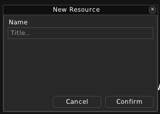
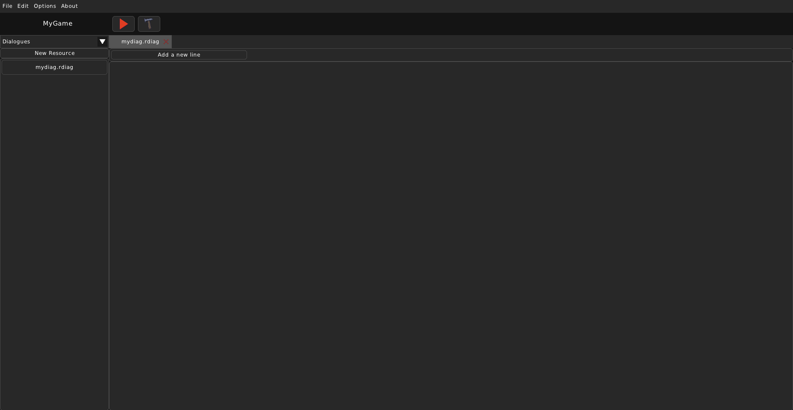
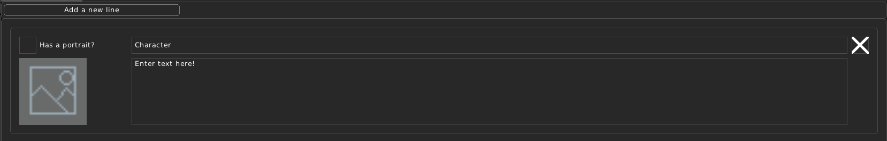
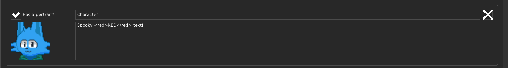

Dialogue
========

===================
What is a Dialogue?
===================

A dialogue is a set of dialogue lines. Dialogue liens themselves contain a text content, an optional portrait and a character name.

Example of a Dialogue file (.rdiag):

.. code:: json

    {
        "diag": [
            [
                "Xenith",
                "I changed the dialogue!",
                "0",
                ""
            ],
            [
                "Xenith",
                "This is the second line!",
                "0",
                ""
            ],
            [
                "Xenith",
                "Content",
                "0",
                ""
            ]
        ]
    }

===============================
Creating and editing a Dialogue
===============================

For a Dialogue, you just need a name.

When viewing a Dialogue, you will see an "Add a new line" button and a list of all the dialogue lines. New Dialogues will have no dialogue lines by default.

The "Add a new line" button will add a new line to this Dialogue.

The "Has a portrait?" option sets whether this line will have a portrait image shown for it. If it is on, then you can select an image to be shown.

You can also edit the Character name and the text content for the dialogue line. 

The 'X' button deletes this line.

