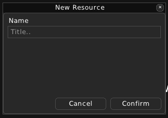
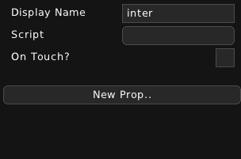

Interactable
============

=======================
What is an Interactable
=======================

An Interactable is an object that the player can interact with. It has an attached script that defines its behaviour. It can placed on its own or exist within a Prop or an Actor.

Example of an Interactable file:

.. code:: json

    {
        "name":"myinter",
        "onTouch":false,
        "props":{
            "newint":0,
            "x":0
        },
        "script":"scripts/test.lua"
    }

====================================
Creating and editing an Interactable
====================================

To create an Interactable, you just need to give it a name. 

Then you can edit its properties.

* **Display Name** - Sets a friendly name that will show up only in the editor.

* **Script** - Sets a Lua script that will define the Interactable's behaviour. THe script must have an interact() function.

* **On Touch?** - Whether this Interactable will trigger when the player collides with the interactable.

On top of that, you can add or remove your own properties for the Interactable.
