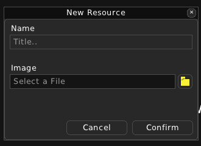
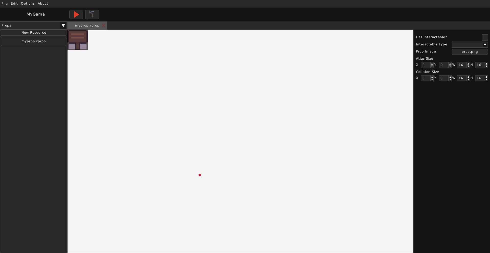

Prop
====

===============
What is a Prop?
===============

A Prop represents an object in the Room that the Player may be able to interact with.

Example file contents of a Prop file (.rprop):

.. code:: json

    {
        "atlas_rect": [
            0,
            0,
            16,
            16
        ],
        "collision_rect": [
            0,
            0,
            16,
            16
        ],
        "has_interactable": false,
        "image": "images/prop.png",
        "interactable_type": ""
    }

===========================
Creating and editing a Prop
===========================

To create a Prop, you need to give it a name and a name and an image.

When opening a Prop, you can see a view of the Prop Image, in which you can drag around or zoom in and out. To the right are the properties of this Prop.

In the Prop view, the Atlas Rect has a blue rectangle, while the Collision Rect has a red rectangle. Both are moveable and resizeable using the mouse.

You can choose if this Prop will have an Interactable. If yes, then you can choose the type of Interactable that this Prop will have.

You can also change the image for this Prop.

Atlas Rect refers to the portion of the Prop Image, that will be shown.
Collision Rect refers to the position and size of the collision, relative to the top left corner of the Prop.
Both properties have X and Y for position and W and H for size.
