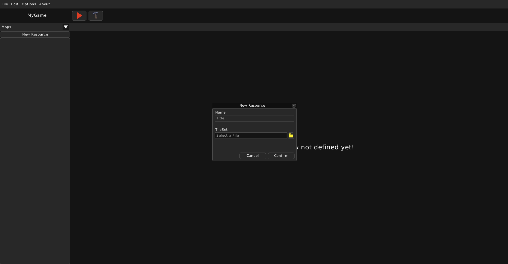
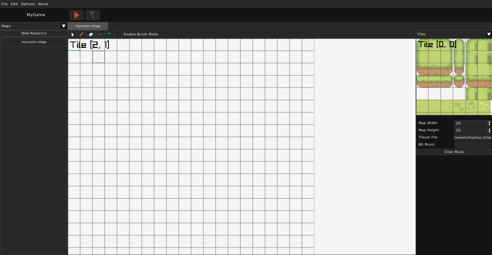
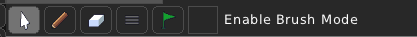
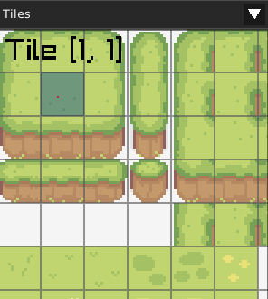
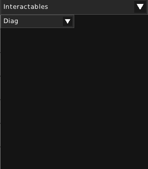
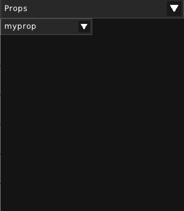
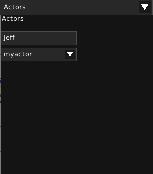

Room
====

===============
What is a Room?
===============

A Room represents a scene that contains a TileMap, interactables, collisions, NPCs and the Player. It is essentially the world in a sense. You can think of TileMap, interactables, collisions and the NPCs as different layers.

Rooms have the ``.rmap`` extension. The base Room's file contents looks like this, where "map" is filled with arrays of [-1, -1]. The first element is the x atlas position and the second element is the y atlas position.

.. code:: json

    {
    	"actors": {},
    	"collision": [],
    	"height": 20,
    	"interactables": {},
    	"map": [],
    	"music_source": "",
    	"props": {},
    	"start_pos": [0, 0],
    	"tileSize": 48,
    	"tileset": "tilesets/mytiles.rtiles",
    	"width": 20
    }

===========================
Creating and editing a Room
===========================

You can create a Room the usual way you create any other resource. You will be asked for a room title and a TileSet to be used for the Room.

The basic properties of the Room will appear on the right. You can change the map's width and height. The default size is 20x20 (the size is in amount of tiles!). You can also change the TileSet, which is used for this Room. The background music can be set with "BG Music" or cleared with "Clear Music"

=========
Map Tools
=========

On the top, you can see the tools you can use to edit the map.

We've got:

* **Mouse**:
    - It does not edit the map in any way and can be used to just pan around the map.

* **Place**:
    - You can place a chosen tile from the TileSet, an interactable, etc.

* **Erase**:
    - You can erase a tile on the map.

* **Edit**:
    - Change the selected map tile to use another atlas position from the TileSet.

* **Start Point**:
    - Change the Start Point where the Player will spawn upon entering this Room.

* **Brush Mode**:
    - Toggle brush mode, which would continuously place tiles as you hold the left mouse button.

Keep in mind that the tools' functions depend on the currently selected layer. If it is Tiles, then you can place tiles. If it is Collisions, then you can place collision tiles and etc.

==========
Map Layers
==========

The Map editor introduces several layers, which are used to edit different parts of the map.

* **Tiles**:
    - The Tiles layer can be used to place, erase or edit tiles on the map. It allows you to choose which tile from the TileSet shall be placed.

* **Collisions**:
    - Allows you to place or erase 'collision tiles'. The Player will collide on them.

* **Interactables**:
    - Allows you to place, erase or edit Interactables - special tiles that the Player can interact with. You can select the Interactable you want to place. The engine offers built-in Interactables; Dialogue and Warper. You can edit the already placed interactables' properties.

* **Props**:
    - Allows you to add, erase or edit Props. Props are like Interactables, but their appearance depends on their image.

* **Actors**:
    - Allows you to place or erase Actors. Actors is the name used to refer to NPCs or characters that you can place in the room. Actors must be given a name.

