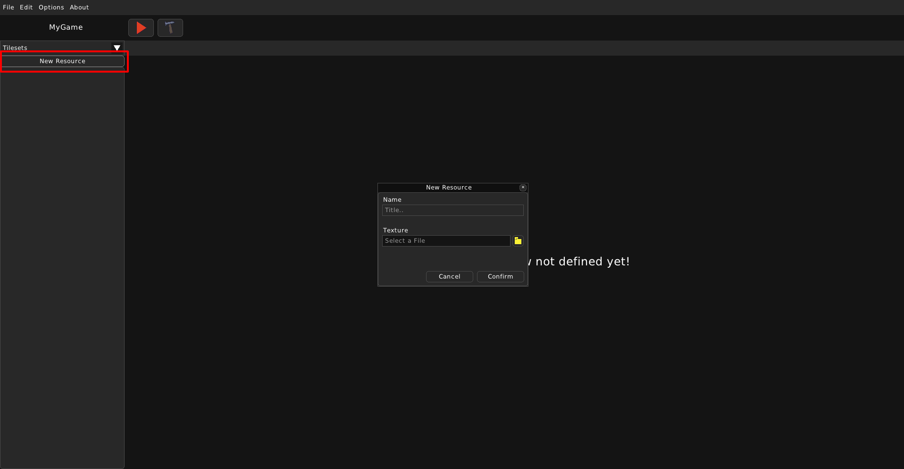
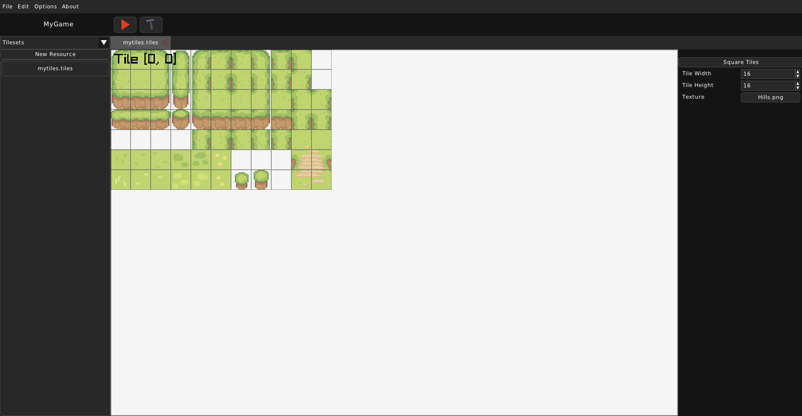

TileSet
=======

==================
What is a TileSet?
==================

A TileSet is a collection of tiles, created from one image. It is used to make up the map in a game.
TileSets have a source image, a tile width and a tile height. A TileSet with an equal tile width and tile height can be called one with square tiles.

Every tile `within a TileSet` has an atlas position with x and y. The amount of tiles and their positions will depend on the width and height of the image used.

.. code:: json

    {
        "source": "images/Hills.png",
        "tileWidth": 16,
        "tileHeight": 16
    }

=============================
Creating and editing TileSets
=============================

To create a TileSet resource, make sure you've selected "Tilesets" from the dropdown and click "New Resource". A dialog window for creating a TileSet resource will appear. You can choose a name for this TileSet. It will appear in the TileSet's filename. You can also choose the image that will be used for it.

Once you've created a TileSet, a new tab will appear. On the right side, you can see the properties of this TileSet.

You can edit the tile width and height here. The "Square Tiles" button sets the tile width and tile height to be equal, by choosing the smaller of the too and setting both properties to that size. If the tile size was 32x16, then it would be 16x16 after clicking that button.

The Texture property defines what image is used for this TileSet and essentially what will actually be drawn for it. Upon clicking the button, a file dialog will appear, asking you to choose an image that will be used. In the file itself, "source" will be set to "images/<filename>", where filename can be a value like "Hills.png".

